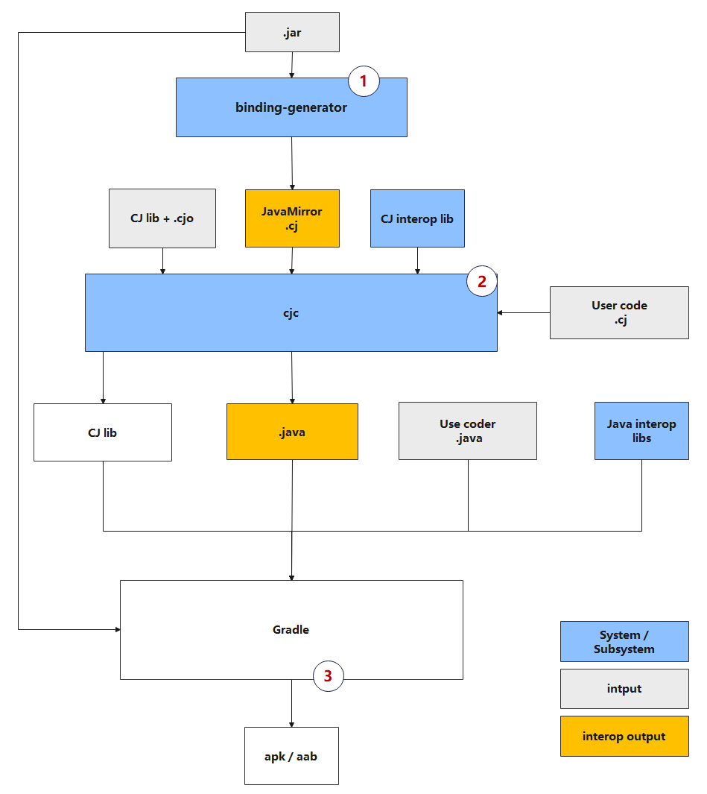
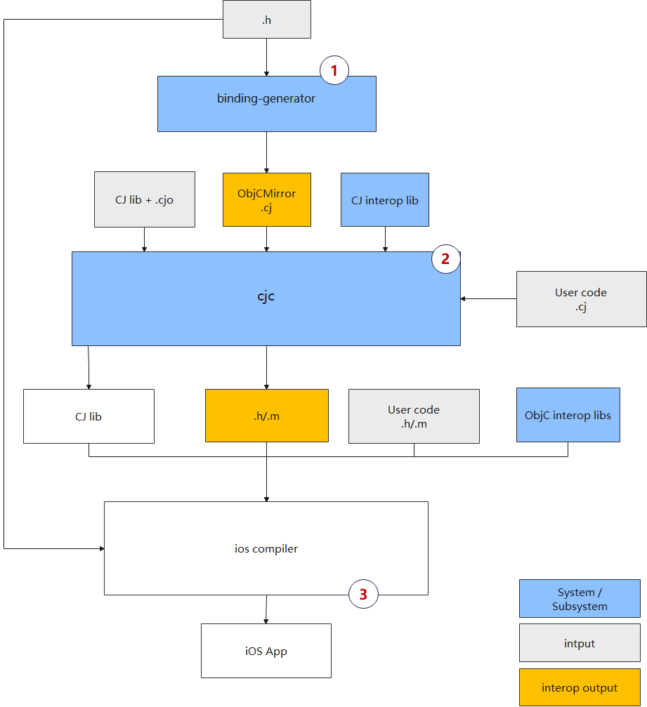

# Cangjie Interoperability Subsystem

## Introduction

Cangjie provides developers with the capability to interoperate with Java and Objective-C languages. After successfully installing the Cangjie toolchain, you can use these capabilities according to the manual.

## System Architecture

Overall Architecture of Cangjie-Java Interop:



Overall Architecture of Cangjie-ObjC Interop:



This repository provides the following tools in the interop toolchain:

* Java binding-generator: A tool provided in the Cangjie SDK, with the filename java-mirror-gen.jar. It is used to automatically generate Cangjie-format Mirror Types based on Java .class files.
* ObjC binding-generator: A tool for generating Objective-C (ObjC) mirror files.

## Directory Structure

```
|--java
   |-- build   # Build scripts
   |-- doc     # Documentation
   |-- src     # Source code files
       |-- interoplib # Interop library
       |-- java-mirror-gen # Cangjie mirror file generation tool
   |-- test # Test cases
|--objc
   |-- build  # Build scripts
   |-- doc    # Documentation
   |-- src    # Source code files
       |-- interoplib    # Interop library
       |-- ObjCInteropGen    # Source code of Cangjie mirror generator
   |-- test    # Test cases
   |-- third_party    # Code for TOML file reading and writing functions
```

For detailed information, please refer to the user guides under each component's `doc` directory:

- Cangjie-Java:
    - [Cangjie-Java User Guide](https://gitcode.com/Cangjie/cangjie_docs/tree/main/docs/dev-guide/source_zh_cn/multiplatform/cangjie-android-Java.md)
    - [Cangjie-Java Developer Guide](./java/doc/developer_guide.md)
- Cangjie-ObjC:
    - [Cangjie-ObjC User Guide](https://gitcode.com/Cangjie/cangjie_docs/tree/main/docs/dev-guide/source_zh_cn/multiplatform/cangjie-ios-objc.md)
    - [Cangjie-ObjC Developer Guide](./objc/doc/developer_guide.md)

## Build Dependencies

The Cangjie interoperability toolkit depends on the Cangjie SDK for building. Please refer to the [Cangjie SDK Integration and Build Guide](https://gitcode.com/Cangjie/cangjie_build/blob/dev/README.md).

## Open Source License

This project is licensed under the [Apache-2.0 with Runtime Library Exception](./LICENSE). Feel free to enjoy and participate in the open-source community.

## Related Repositories

* [cangjie compiler](https://gitcode.com/Cangjie/cangjie_compiler)
* [cangjie test](https://gitcode.com/Cangjie/cangjie_test)

## Open Source Software Statement

| Open-Source Software Name               | Open-Source License             | Usage Description                  | 	User Entity | Usage Method         |
|----------------------|---------------------|-----------------------|------|--------------|
| bishengjdk         | GPLv2 with Classpath Exception  | The Java Mirror generation tool uses javac source code to parse Java class files and generates corresponding mirrors during the syntax parsing phase| Language Service | Integrated in the tool release package |
| tinytoml  | BSD-2-Clause        | The ObjC Mirror generation tool is used to parse TOML configuration files      | Language Service | Integrated in the tool release package |

## Contribution

We welcome contributions from developers in any form, including but not limited to code, documentation, issues, and more.